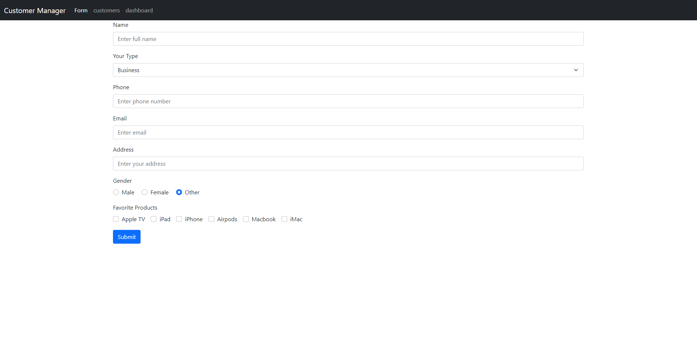
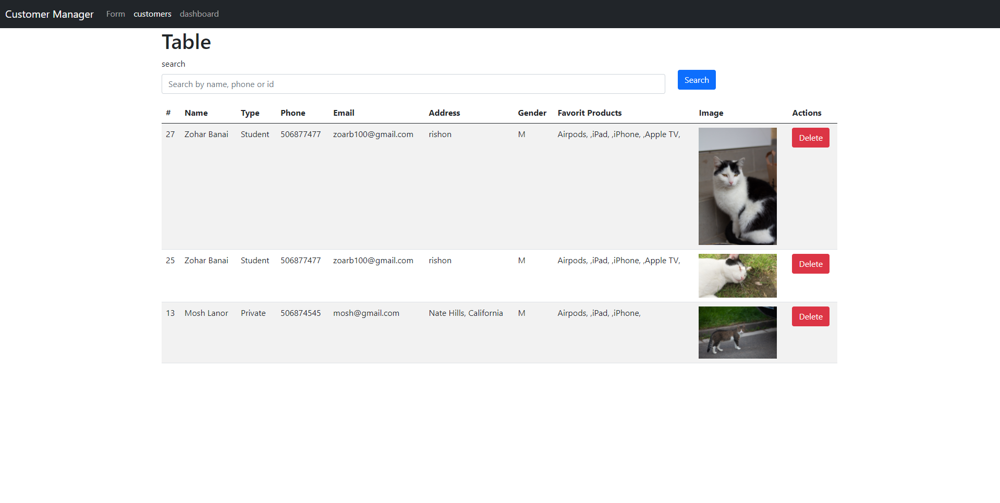
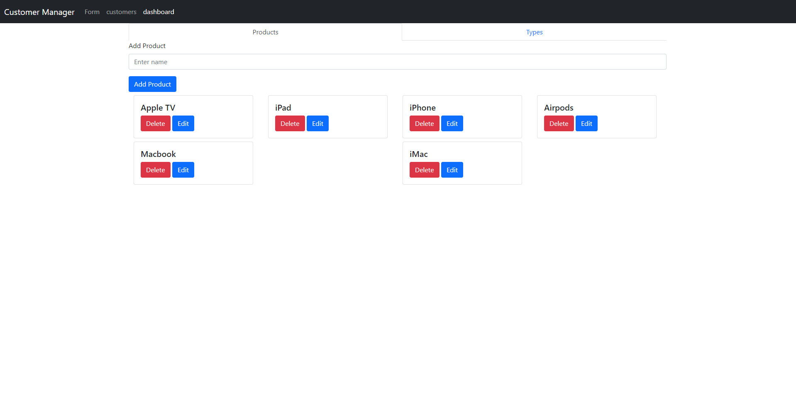

## Customers Manager

> Customer manager project built with PHP, Jquery, ajax without frameworks.

## Usage





## Database

1. run customerManager.sql file.

2. Check Database nodel variable in config/Database.php:

```
  private $host = (db host);
  private $db_name = 'customers_manager';
  private $username = (your db username);
  private $password = (your db password);
```

## Run

# Backend

In the main folder run the following command:

```
php -S localhost:8000
```

# Frontend

In the main folder run the following command:

```
cd ./frontend/public

composer install

php -S localhost:3000
```

client run on port 3000
